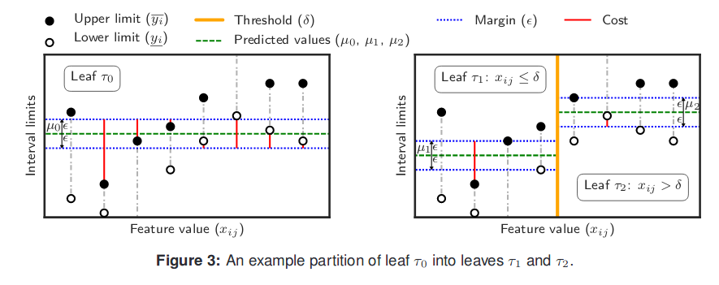
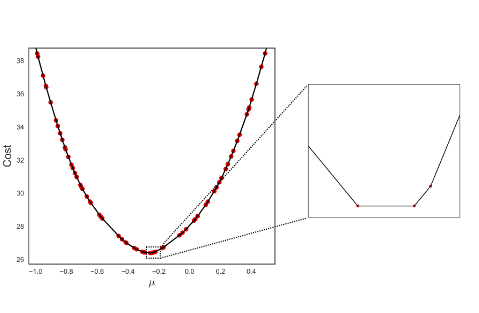
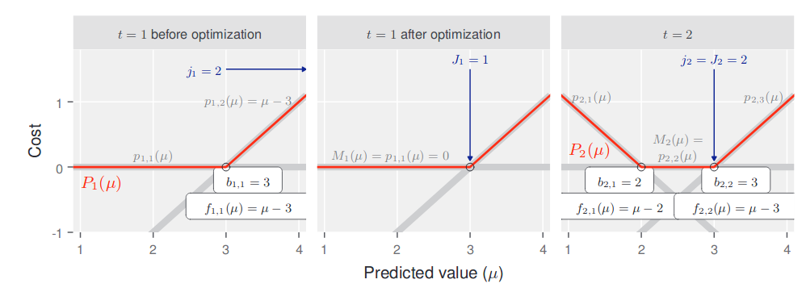

```{r setup, include=FALSE}
knitr::opts_chunk$set(echo = TRUE)
```

*Authors: Parismita Das, Alexandre Drouin, Torsten Hothorn and Toby Dylan Hocking*

---------------------------------------------------------------

## Overview


There are few R packages available for interval regression, a machine learning problem 
which is important in genomics and medicine. Like usual regression, the goal is to learn 
a function that inputs a feature vector and outputs a real-valued prediction. 
Unlike usual regression, each response in the training set is an interval of acceptable 
values (rather than one value). In the terminology of the survival analysis literature, 
this is regression with “left, right, and interval censored” output/response data.

Max margin interval trees are a new type of nonlinear model for this problem ([Drouin et al., 2017](https://papers.nips.cc/paper/7080-maximum-margin-interval-trees)). A dynamic programming algorithm is used for computing the optimal solution inlog-linear time. We show empirically that this algorithm achieves state-of-the-art speed and prediction accuracy in a benchmark of several data sets.
This algorithm was implemented using the *partykit* library for creation of tree structure and better visualization.
 
Specifically, the following learning algorithms are implemented in the mmit package:

  * Max margin interval trees (mmit, mmit.predict, mmit.pruning, mmit.cv)
  * Max margin interval random forests (mmif, mmif.predict, mmif.cv)
  * Max margin interval Adaboost (in progress) 
  

For each algorithm, we implemented the following:

* Learning: input examples represented by their features and interval label and output a model (single party object or list of party objects)
* Cross-validation: grid seach k-fold cross-validation to select the hyperparameters
* Prediction: input examples represented by their features and output predictions
* Minimum cost-complexity pruning (for MMIT only): reduce the size of trees by cutting branches

This document is an short overview of the functionalities of the mmit package. The overview of the work done as part of Google summer of code is covered [here](https://aldro61.github.io/mmit/tutorials/R/)
 
-----------------------------------------------------------------------------------------------------------

## Table of contents

* [Installation](#installation)

* [Building the tree]
    * [Splitting algorithm]
    * [mmit](#mmit)
    * [Prediction](#prediction)
    
* [Pruning]
    * [mmit.pruning](#mmit.pruning)
  
* [K-fold Cross Validation]
    * [mmit.cv](#mmit.cv)
  
* [Random Forest]
    * [mmif](#mmif)
    * [mmif.predict](#mmif.predict)
    * [mmif.cv](#mmif.cv)
  
* [Other Functions]
    * [mse](#mse)
    * [zero_one_loss](#zero_one_loss)

-----------------------------------------------------------------------------------------------------
## Installation

The `mmit` R package can be installed via the following R
commands.

```
if(!require(devtools))install.package("devtools")
devtools::install_github("aldro61/mmit/Rpackage")
```

----------------------------------------------------------------------------------------------------------

## Building the tree
  
As Breiman's CART algorithm is widely used for creation of decision trees, random forest and boosted decision trees. In the CARTS algorithm, trees are grown by recursive partitioning of leaves, each time maximizing some task-specific criterion. It has the ability to learn non-linear models from both numerical and categoricaldata of various scales, and also has a relatively low training time complexity. Hence we will be using the same concept in building maximum margin interval trees.

#### The Learning Setting
The training data is a set of labelled examples, where the target values are intervals indicating a range of acceptable values:
$$S = {(x_1,y_1), (x_2,y_2)... (x_n,y_n)}$$
where $x \epsilon R^n$ is the feature variable of the model and $y = [\underline{y},\bar{y}]$ is the intervaled target data.

#### The Loss Function
We consider two types of losses, hinge and squared. As our target data is interval type, hence the loss inside the interval is zero and outside follow the linear or quadratic function. We aim to minimise the convex objective function for model $h$ $$\phi_l(\underline{y_i}-h(x_i)+\epsilon) + \phi_l(h(x_i)-\bar{y_i}+\epsilon)$$ where $l$ is a convex function and $\phi_l(x) = l[(x)+]$ is the loss, where $(x)_+$ is the positive part of the function and $\epsilon$ as the margin hyperparameter with regularizing effect.

Linear hinge loss: $l(x) = x$

Squared hinge loss: $l(x) = x^2$


### Splitting algorithm
As proposed in the paper, the splitting is done using margin-based loss function, which yields a sequence of convex optimization problems. A dynamic programming algorithm is used to compute the optimal solution to all of these problems in log-linear time. Hence obtaining the optimal splitting value. 


#### Partitioning Leaf

The partitioning of the tree into left and right leaf is done using 2 convex minimization problem and considering the splitting index based on minimum cost of sum of cost of left and right leaves.

```{r, out.width = "700px", echo=FALSE}

```


#### Dynamic programing

The dynamic programing algorithm is used to calculate the total loss of the optimal prediction. The sum of above mentioned hinge losses is a convex piecewise function $Pt(\mu)$. 

```{r, out.width = "400px", echo=FALSE}

```

While tracking the functions minima, the dynamic programming algorithm maintains a pointer on the left-most breakpoint that is to the right of all minima of $Pt(\mu)$.  The optimization step consists in finding the new position of this pointer after a hinge loss is added to the sum.

```{r, out.width = "700px", echo=FALSE}

```

In this Fig, First two steps of the dynamic programming algorithm for the data $y_1= 4, s_1= 1, y_2= 1, s_2=−1$ and margin $\epsilon = 1$, using the linear hinge loss $l(x) = x$. 

* Left: The algorithm begins by creating a first breakpoint at $b_{1,1} = y_1−\epsilon= 3$, with corresponding function $f_{1,1}(\mu) =\mu−3$.  At this time, we have $j_1= 2$ and thus $b_{1,j_1}=∞$.  Note that the cost $p_{1,1}$ before the first breakpoint is not yet stored by the algorithm. 

* Middle: The optimization step is to move the pointer to the minimum ($J_1=j_1−1$) and update the cost function, $M_1(\mu) =p_{1,2}(\mu)−f_{1,1}(\mu)$.

* Right: The algorithm adds the second breakpoint at $b_{2,1}=y_2+\epsilon= 2$ with $f_{2,1}(μ) =μ−2$. The cost at the pointer is not affected by the new data point, so the pointer does not move.

### mmit()
  
This function is used to create the maximum margin interval trees. It returns the learned tree as a party object.

#### Usage:
  
`mmit(feature.mat, target.mat, max_depth = Inf, margin = 0, loss = "hinge",
min_sample = 1)`
  
#### Example:
  
```R
library(mmit)
target.mat <- rbind(
  c(0,1), c(0,1), c(0,1),
  c(2,3), c(2,3), c(2,3))

feature.mat <- rbind(
  c(1,0,0), c(1,1,0), c(1,2,0),
  c(1,3,0), c(1,4,0), c(1,5,0))

colnames(feature.mat) <- c("a", "b", "c")
feature.mat <- data.frame(feature.mat)


out <- mmit(feature.mat, target.mat)
```

#### Output:

```{r mmitplot, echo=FALSE}
library(mmit, quietly=TRUE)
target.mat <- rbind(
  c(0,1), c(0,1), c(0,1),
  c(2,3), c(2,3), c(2,3))

feature.mat <- rbind(
  c(1,0,0), c(1,1,0), c(1,2,0),
  c(1,3,0), c(1,4,0), c(1,5,0))

colnames(feature.mat) <- c("a", "b", "c")
feature.mat <- data.frame(feature.mat)


out <- mmit(feature.mat, target.mat)
plot(out)
```

### Prediction
  
The prediction is done using mmit.predict(). It fits the new data into the MMIT model to give prediction values
  
#### Usage:
  
`mmit.predict(tree, newdata = NULL, perm = NULL)`
  
#### Example:
  
```R
library(mmit)
target.mat <- rbind(
  c(0,1), c(0,1), c(0,1),
  c(2,3), c(2,3), c(2,3))

feature.mat <- rbind(
  c(1,0,0), c(1,1,0), c(1,2,0),
  c(1,3,0), c(1,4,0), c(1,5,0))

colnames(feature.mat) <- c("a", "b", "c")
feature.mat <- data.frame(feature.mat)

tree <- mmit(feature.mat, target.mat)
pred <- mmit.predict(tree)
```

#### Output:

```{r mmit.predictoutput, echo= FALSE}
library(mmit, quietly=TRUE)
target.mat <- rbind(
  c(0,1), c(0,1), c(0,1),
  c(2,3), c(2,3), c(2,3))

feature.mat <- rbind(
  c(1,0,0), c(1,1,0), c(1,2,0),
  c(1,3,0), c(1,4,0), c(1,5,0))

colnames(feature.mat) <- c("a", "b", "c")
feature.mat <- data.frame(feature.mat)

tree <- mmit(feature.mat, target.mat)
pred <- mmit.predict(tree)
print(pred)
```

## Pruning

Overfitting happens when the learning algorithm continues to develop hypotheses that reduce training set error at the cost of an increased test set error. To prevent overfitting of the decision trees, we implemented post pruning. In post pruning methods, the trees are pruned after they are build. In mmit.pruning() function, we have implemented a bottom-up algorithm of minimum cost complexity pruning.

#### Algorithm

* Initialization
    * Let $T^1$ be tree obtained with $\alpha^1 = 0$. This is the initial tree with no regularization. Where \alpha is a Regularization parameter
    * minimize R(T) where R(T) is the training/learning error
* Step 1 
    * select node $t \epsilon T^1$ that minimizes the function $$g_1(t) = \frac{R(t) - R(T^1_t)}{|f(T^1_t)|-1}$$ where $f(T)$ is a function that returns the set of leaves of tree T
    * let $t_1$ be this node
    * let $α^2=g_1(t_1)$ and $T^2=T^1−T^1_{t_1}$
* Step i
    * select node $t \epsilon T^i$ that minimizes the function $$g_i(t) = \frac{R(t) - R(T^i_t)}{|f(T^i_t)|-1}$$ 
    * let $t_i$ be this node
    * let $α^{i+1}=g_i(t_i)$ and $T^{i+1}=T^i−T^i_{t_i}$
    
#### Output

* a sequence of trees $T_1⊇T_2⊇ ... ⊇T_k⊇ ... ⊇\{root\}$
* a sequence of parameters $α_1⩽α_2⩽ ... ⩽α_k⩽ ...$

### mmit.pruning()
  
Pruning the regression tree for censored data to give all the alpha (regularization parameter) values and trees as output.
  
#### Usage:

`mmit.pruning(tree)`
  
#### Example:
  
```R
library(mmit)
target.mat <- rbind(
  c(0,1), c(0,1), c(0,1),
  c(2,3), c(2,3), c(2,3))

feature.mat <- rbind(
  c(1,0,0), c(1,1,0), c(1,2,0),
  c(1,3,0), c(1,4,0), c(1,5,0))

colnames(feature.mat) <- c("a", "b", "c")
feature.mat <- data.frame(feature.mat)


tree <- mmit(feature.mat, target.mat)
pruned_tree <- mmit.pruning(tree)
```

#### Output:


```{r mmit.pruningplot, echo=FALSE}
library(mmit, quietly=TRUE)
target.mat <- rbind(
  c(0,1), c(0,1), c(0,1),
  c(2,3), c(2,3), c(2,3))

feature.mat <- rbind(
  c(1,0,0), c(1,1,0), c(1,2,0),
  c(1,3,0), c(1,4,0), c(1,5,0))

colnames(feature.mat) <- c("a", "b", "c")
feature.mat <- data.frame(feature.mat)


tree <- mmit(feature.mat, target.mat)
pruned_tree <- mmit.pruning(tree)

print("pruned tree for alpha = 0")
plot(pruned_tree[[1]]$tree)
print("pruned tree for alpha = 3")
plot(pruned_tree[[2]]$tree)
```

## K-fold Cross Validation 

Performing grid search to select the best parameters via cross validation on the a regression tree for censored data.
It outputs all the CV results, the best model and best parameters. It is done using the mmit.cv() function.

### mmit.cv()
  
#### Usage:
  
`mmit.cv(feature.mat, target.mat, param_grid, n_folds = 3, scorer = NULL, pruning = TRUE, future.seed = FALSE)`
  
#### Example:
  
```R
library(mmit)
data(neuroblastomaProcessed, package="penaltyLearning")
feature.mat <- data.frame(neuroblastomaProcessed$feature.mat)[1:45,]
target.mat <- neuroblastomaProcessed$target.mat[1:45,]
  
param_grid <- NULL
param_grid$max_depth <- c(Inf, 2)
param_grid$margin <- c(2, 3)
param_grid$min_sample <- c(10, 20)
param_grid$loss <- c("hinge", "square")
if(require(future)){ plan(multiprocess)}
set.seed(1)
result <- mmit.cv(feature.mat, target.mat, param_grid, scorer = mse, future.seed = TRUE)
```

#### Output:
```{r mmit.cv1, echo= FALSE}
library(mmit, quietly=TRUE)
data(neuroblastomaProcessed, package="penaltyLearning")
feature.mat <- data.frame(neuroblastomaProcessed$feature.mat)[1:45,]
target.mat <- neuroblastomaProcessed$target.mat[1:45,]
  
param_grid <- NULL
param_grid$max_depth <- c(Inf, 2)
param_grid$margin <- c(2, 3)
param_grid$min_sample <- c(10, 20)
param_grid$loss <- c("hinge", "square")
set.seed(1)
result <- mmit.cv(feature.mat, target.mat, param_grid, scorer = mse, future.seed = TRUE)
print('result: ')
print(result$best_params)
print("best estimator: ")
plot(result$best_estimator)
```

## Random Forest

The random forest implemented in the mmit package uses the concept of random forest described by Brietman.
The mmif function is used for creating the collection of trees by random sampling training examples with replacement and features without replacement. The mmif.predict() function is used to calculate the average prediction done by the random forest algorithm and mmif.cv() function is the implementaiton of k-fold cross validaiton for the random forest model.

### mmif()
  
Learning a random forest of Max Margin Interval Tree and giving list of trees as output.
  
#### Usage:

`mmif(feature.mat, target.mat, max_depth = Inf, margin = 0, loss = "hinge",
min_sample = 1, n_trees = 10,
n_features = ceiling(ncol(feature.mat)^0.5), future.seed = FALSE)`
  
#### Example:
  
```R
library(mmit)

  data(neuroblastomaProcessed, package="penaltyLearning")
  feature.mat <- data.frame(neuroblastomaProcessed$feature.mat)[1:45,]
  target.mat <- neuroblastomaProcessed$target.mat[1:45,]
  if(require(future)){ plan(multiprocess)}
  set.seed(1)
  trees <- mmif(feature.mat, target.mat, max_depth = Inf, margin = 2.0, loss = "hinge", min_sample = 1, future.seed = TRUE)
```

#### Output:
```{r mmif, fig.width=6, fig.height=4, echo=FALSE}
library(mmit, quietly=TRUE)

  data(neuroblastomaProcessed, package="penaltyLearning")
  feature.mat <- data.frame(neuroblastomaProcessed$feature.mat)[1:45,]
  target.mat <- neuroblastomaProcessed$target.mat[1:45,]
  if(require(future)){ plan(multiprocess)}
  set.seed(1)
  trees <- mmif(feature.mat, target.mat, max_depth = Inf, margin = 2.0, loss = "hinge", min_sample = 1, future.seed = TRUE)
  for(i in trees){plot(i)}
```

### mmif.predict()
  
Predictions with random forests of Max Margin Interval Trees

#### Usage:

`mmif.predict(forest, test_feature.mat = NULL)`

#### Example:
  
```R
library(mmit)

target.mat <- rbind(
  c(0,1), c(0,1), c(0,1),
  c(2,3), c(2,3), c(2,3))

feature.mat <- rbind(
  c(1,0,0), c(1,1,0), c(1,2,0),
  c(1,3,0), c(1,4,0), c(1,5,0))

colnames(feature.mat) <- c("a", "b", "c")
feature.mat <- data.frame(feature.mat)

forest <- mmif(feature.mat, target.mat)
pred <- mmif.predict(forest, feature.mat)
```

#### Output:
```{r mmif.predict, echo=FALSE}
library(mmit, quietly=TRUE)

target.mat <- rbind(
  c(0,1), c(0,1), c(0,1),
  c(2,3), c(2,3), c(2,3))

feature.mat <- rbind(
  c(1,0,0), c(1,1,0), c(1,2,0),
  c(1,3,0), c(1,4,0), c(1,5,0))

colnames(feature.mat) <- c("a", "b", "c")
feature.mat <- data.frame(feature.mat)

forest <- mmif(feature.mat, target.mat)
pred <- mmif.predict(forest, feature.mat)
print(pred)
```

### mmif.cv()
  
Performing grid search to select the best hyperparameters of mmif via cross-validation.
  
#### Usage:

`mmif.cv(feature.mat, target.mat, param_grid, n_folds = 3, scorer = NULL, future.seed = FALSE)`
  
#### Example:
  
```R
library(mmit)

data(neuroblastomaProcessed, package="penaltyLearning")
feature.mat <- data.frame(neuroblastomaProcessed$feature.mat)[1:45,]
target.mat <- neuroblastomaProcessed$target.mat[1:45,]
 
param_grid <- NULL
param_grid$max_depth <- c(4, 3)
param_grid$margin <- c(2, 3)
param_grid$min_sample <- c(5, 20)
param_grid$loss <- c("hinge", "square")
param_grid$n_trees <- c(10)
param_grid$n_features <- c(as.integer(ncol(feature.mat)**0.5))
if(require(future)){ plan(multiprocess)}
set.seed(1)
result <- mmif.cv(feature.mat, target.mat, param_grid, scorer = mse, future.seed = TRUE)
```

#### Output:
```{r mmif.cv, fig.width=6, fig.height=4, echo=FALSE}
library(mmit, quietly=TRUE)

data(neuroblastomaProcessed, package="penaltyLearning")
feature.mat <- data.frame(neuroblastomaProcessed$feature.mat)[1:45,]
target.mat <- neuroblastomaProcessed$target.mat[1:45,]
 
param_grid <- NULL
param_grid$max_depth <- c(4, 3)
param_grid$margin <- c(2, 3)
param_grid$min_sample <- c(5, 20)
param_grid$loss <- c("hinge", "square")
param_grid$n_trees <- c(10)
param_grid$n_features <- c(as.integer(ncol(feature.mat)**0.5))
if(require(future)){ plan(multiprocess)}

set.seed(1)
result <- mmif.cv(feature.mat, target.mat, param_grid, scorer = mse, future.seed = TRUE)
print('result: ')
print("best estimators: ")
for(i in result$best_estimator){
  plot(i)
}
```

## Other Functions

### mse()
  
Calculation of the mean square error for intervals.
  
#### Usage:

`mse(y_true, y_pred)`

#### Example:
  
```R
library(mmit)
y_true <- rbind(
  c(0,1), c(0,1), c(0,1),
  c(2,3), c(2,3), c(2,3))

y_pred <- c(0.5, 2, 0, 1.5, 3.5, 2.5)

out <- mse(y_true, y_pred)
```

#### Output:
```{r mse, echo= FALSE}
library(mmit, quietly=TRUE)
y_true <- rbind(
  c(0,1), c(0,1), c(0,1),
  c(2,3), c(2,3), c(2,3))

y_pred <- c(0.5, 2, 0, 1.5, 3.5, 2.5)

out <- mse(y_true, y_pred)
print(out)
```

### zero_one_loss()
  
Calculation of the zero-one loss for interval, i.e., zero error if the prediction is inside the interval and one error if it is ouside.
  
#### Usage:

`zero_one_loss(y_true, y_pred)`
  
#### Example:
  
```R
library(mmit)
y_true <- rbind(
  c(0,1), c(0,1), c(0,1),
  c(2,3), c(2,3), c(2,3))

y_pred <- c(0.5, 2, 0, 1.5, 3.5, 2.5)

out <- zero_one_loss(y_true, y_pred)
```

#### Output:

```{r zero, echo=FALSE}
library(mmit, quietly=TRUE)
y_true <- rbind(
  c(0,1), c(0,1), c(0,1),
  c(2,3), c(2,3), c(2,3))

y_pred <- c(0.5, 2, 0, 1.5, 3.5, 2.5)

out <- zero_one_loss(y_true, y_pred)
print(out)
```


