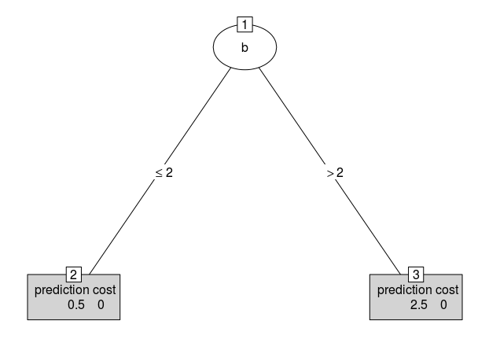
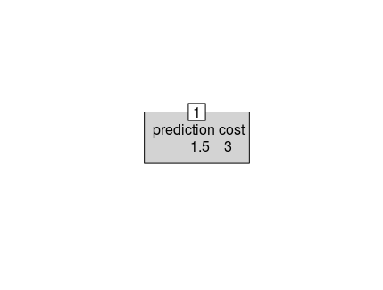
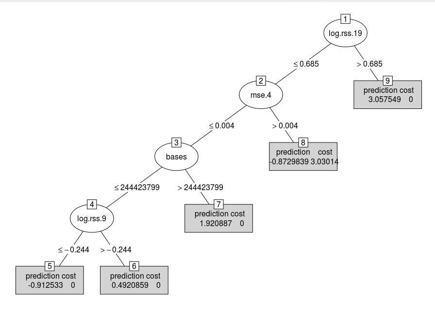

# Google Summer of Code, 2018: MMIT

#### Summary of the Maximum Margin Interval Trees (MMIT) project under the R project for statistical computing.

*Student: Parismita Das*

*Mentors : Alexandre Drouin, Torsten Hothorn and Toby Dylan Hocking*

---------------------------------------------------------------

## Table of contents

* [Introduction](#introduction)
* [Evaluations](#evaluations)
  * [First Evaluation](#first-evaluation)
  * [Second Evaluation](#second-evaluation)
  * [Final Evaluation](#final-evaluation)
* [Contributions](#contributions)
* [Future Work](#future-work)
* [Tutorials](#tutorials)

 
 
 ## Introduction

There are few R packages available for interval regression, a machine learning problem 
which is important in genomics and medicine. Like usual regression, the goal is to learn 
a function that inputs a feature vector and outputs a real-valued prediction. 
Unlike usual regression, each response in the training set is an interval of acceptable 
values (rather than one value). In the terminology of the survival analysis literature, 
this is regression with “left, right, and interval censored” output/response data.

Max margin interval trees are a new type of nonlinear model for this problem ([Drouin et al., 2017](https://papers.nips.cc/paper/7080-maximum-margin-interval-trees)). 
This algorithm has previously been implemented in Python and the objective of this Google Summer of Code project was to implement it in R using the *partykit* library.
 
Specifically, we implemented the following learning algorithms:
  * Max margin interval trees
  * Max margin interval random forests
  * Max margin interval Adaboost (in progress) 
  

For each algorithm, we implemented the following:
* Learning: input examples represented by their features and interval label and output a model (single party object or list of party objects)
* Cross-validation: grid seach k-fold cross-validation to select the hyperparameters
* Prediction: input examples represented by their features and output predictions
* Minimum cost-complexity pruning (for MMIT only): reduce the size of trees by cutting branches
 
We also created documentation for each of these functions.

 
 -------------------------------------------------------------------------------------------------
 
 <h2>Evaluations</h2><a name="evaluations"></a> 
 
 
 ### First Evaluation
 
 For the major part of the first coding period, the main aim was to build the maximum margin interval tree (mmit) 
 along with its k-fold cross validation and minimum cost-complexity pruning functions. 
 The tree model was build using partykit which made it very easy to visualize the tree structure 
 and get its prediction values. The tree model and pruning was done to a large extent including 
 appropriate documentation and unit tests which helped later on in the project. 
 Although the implementation of cross validation took longer than expected.
  
### Second Evaluation

After building the MMIT model, most of the second coding phase was spent on bug fixing and building unit tests and examples, along with completing the cross validation for the MMIT. The cross validation function consist of 
option for enabling and disabling the pruning of MMIT. It does Grid search on all the parameters and gives the best parameters 
along with the list of CV results for all parameters.
To validate the work, a benchmark was created to compare the mmit and pruning model to the python results. The results were similar for larger datasets (variability is expected for small datasets), thus we believe that the implementation is correct.

### Final Evaluation

The final phase work consisted of implementing the Random forest and Adaboost algorithms based on MMIT, along with their cross validation and prediction functions. Since the ultimate goal of GSoC is to build a working package, testing, bug fixing and documentation were completed before adding more features to the package. Getting the code to work proved to be suprisingly (and notoriously) more complicated than imagined, as the main code used for cross validation is common for all modules of the package and had to designed to allow the easy incorporation of new features. Thus it took a lot of time to debug the code to perfection.

----------------------------------------------------------------------------------------------------------

## Contributions

The links to all the commits are given below:

 * MMIT: [Link](https://github.com/aldro61/mmit/pull/24/commits)
 
 * Pruning and Cross-Validation: [Link](https://github.com/aldro61/mmit/pull/25/commits)
 
 * Random Forest: [Link](https://github.com/aldro61/mmit/pull/26/commits)
 
 * Adaboost: [Link](https://github.com/aldro61/mmit/pull/28)
 
 The links for documentation and benchmark
 
 * Documentation: [Link](https://github.com/aldro61/mmit/tree/master/Rpackage/man)
 
 * Benchmark: [Link](https://github.com/aldro61/mmit/blob/master/benchmark/pred_score.md)
  
  -------------------------------------------------------------------------------------------------------


## Future Work

The implementation of Adaboost is currently in progress ([link](https://github.com/aldro61/mmit/pull/28)). As future work, we would like to improve the running time of each function and write the vignettes with the objective of submitting to CRAN.

-----------------------------------------------------------------------------------------------------------
  
  ## Tutorials
  
  Here is a tutorial on how to use the package.
  
  ### mmit()
  
  This function is used to create the maximum margin interval trees. It returns the learned tree as a party object.
  
  #### Usage:
  
  `mmit(target.mat, feature.mat, max_depth = Inf, margin = 0, loss = "hinge",
  min_sample = 1)`
  
  #### Example:
  
```R
library(mmit)
target.mat <- rbind(
  c(0,1), c(0,1), c(0,1),
  c(2,3), c(2,3), c(2,3))

feature.mat <- rbind(
  c(1,0,0), c(1,1,0), c(1,2,0),
  c(1,3,0), c(1,4,0), c(1,5,0))

colnames(feature.mat) <- c("a", "b", "c")
feature.mat <- data.frame(feature.mat)


out <- mmit(target.mat, feature.mat)
plot(out)
```

#### Output:


### mmit.predict()
  
  Fits the new data into the MMIT model to give prediction values
  
  #### Usage:
  
  `mmit.predict(tree, newdata = NULL, perm = NULL)`
  
  #### Example:
  
```R
library(mmit)
target.mat <- rbind(
  c(0,1), c(0,1), c(0,1),
  c(2,3), c(2,3), c(2,3))

feature.mat <- rbind(
  c(1,0,0), c(1,1,0), c(1,2,0),
  c(1,3,0), c(1,4,0), c(1,5,0))

colnames(feature.mat) <- c("a", "b", "c")
feature.mat <- data.frame(feature.mat)

tree <- mmit(target.mat, feature.mat)
pred <- mmit.predict(tree)
print(pred)
```

#### Output:

pred : 0.5 0.5 0.5 2.5 2.5 2.5

### mmit.pruning()
  
Pruning the regression tree for censored data to give all the alpha values and trees as output.
  
  #### Usage:
  
  `mmit.pruning(tree)`
  
  #### Example:
  
```R
library(mmit)
target.mat <- rbind(
  c(0,1), c(0,1), c(0,1),
  c(2,3), c(2,3), c(2,3))

feature.mat <- rbind(
  c(1,0,0), c(1,1,0), c(1,2,0),
  c(1,3,0), c(1,4,0), c(1,5,0))

colnames(feature.mat) <- c("a", "b", "c")
feature.mat <- data.frame(feature.mat)


tree <- mmit(target.mat, feature.mat)
pruned_tree <- mmit.pruning(tree)
```

#### Output:

alpha values: [0, 3]

pruned trees :  

for alpha = 0



for alpha = 3



### mmit.cv()
  
Performing grid search to select the best parameters via cross validation on the a regression tree for censored data.
It outputs all the CV results, the best model and best parameters.
  
  #### Usage:
  
  `mmit.cv(target.mat, feature.mat, param_grid, n_folds = 3, scorer = NULL,
  n_cpu = 1, pruning = TRUE)`
  
  #### Example:
  
```R
library(mmit)
target.mat <- rbind(
  c(0,1), c(0,1), c(0,1),
  c(2,3), c(2,3), c(2,3))

feature.mat <- rbind(
  c(1,0,0), c(1,1,0), c(1,2,0),
  c(1,3,0), c(1,4,0), c(1,5,0))

colnames(feature.mat) <- c("a", "b", "c")
feature.mat <- data.frame(feature.mat)

param_grid <- NULL
param_grid$max_depth <- c(Inf, 4, 3)
param_grid$margin <- c(2, 3, 5)
param_grid$min_sample <- c(2, 5, 10)
param_grid$loss <- c("hinge")

result <- mmit.cv(target.mat, feature.mat, param_grid, scorer = mse)
plot(result$best_estimator)
print(result$cv_results)
```
#### Output:

Best parameters : 

max_depth | margin |min_sample | loss |alpha |
| ---- |:------: | ---------:|---: |---: |
3         |5       |          10|  hinge|      Inf|

### mmif()
  
Learning a random forest of Max Margin Interval Tree and giving list of trees as output.
  
  #### Usage:
  
  `mmif(target.mat, feature.mat, max_depth = Inf, margin = 0, loss = "hinge",
  min_sample = 1, n_trees = 10,
  n_features = ceiling(ncol(feature.mat)^0.5), n_cpu = 1)`
  
  #### Example:
  
```R
library(mmit)

  data(neuroblastomaProcessed, package="penaltyLearning")
  feature.mat <- data.frame(neuroblastomaProcessed$feature.mat)[1:45,]
  target.mat <- neuroblastomaProcessed$target.mat[1:45,]
  trees <- mmif(target.mat, feature.mat, max_depth = Inf, margin = 2.0, loss = "hinge", min_sample = 1)
```

#### Output:

The collection of trees are :  



### mmif.predict()
  
Predictions with random forests of Max Margin Interval Trees
  
  #### Usage:
  
  `mmif.predict(forest, test_feature.mat = NULL)`
  
  #### Example:
  
```R
library(mmit)

target.mat <- rbind(
  c(0,1), c(0,1), c(0,1),
  c(2,3), c(2,3), c(2,3))

feature.mat <- rbind(
  c(1,0,0), c(1,1,0), c(1,2,0),
  c(1,3,0), c(1,4,0), c(1,5,0))

colnames(feature.mat) <- c("a", "b", "c")
feature.mat <- data.frame(feature.mat)

forest <- mmif(target.mat, feature.mat)
pred <- mmif.predict(forest, feature.mat)
print(pred)
```

#### Output:

pred : 0.75 0.95 1.95 2.15 2.15 2.15

### mmif.cv()
  
Performing grid search to select the best hyperparameters of mmif via cross-validation.
  
  #### Usage:
  
  `mmif.cv(target.mat, feature.mat, param_grid, n_folds = 3, scorer = NULL,
  n_cpu = 1)`
  
  #### Example:
  
```R
library(mmit)

target.mat <- rbind(
  c(0,1), c(0,1), c(0,1),
  c(2,3), c(2,3), c(2,3))

feature.mat <- rbind(
  c(1,0,0), c(1,1,0), c(1,2,0),
  c(1,3,0), c(1,4,0), c(1,5,0))

colnames(feature.mat) <- c("a", "b", "c")
feature.mat <- data.frame(feature.mat)

param_grid <- NULL
param_grid$max_depth <- c(Inf, 4, 3)
param_grid$margin <- c(2, 3, 5)
param_grid$min_sample <- c(2, 5, 10)
param_grid$loss <- c("hinge")
param_grid$n_trees <- c(10, 20, 30)
param_grid$n_features <- c(ceiling(ncol(feature.mat)**0.5))

result <- mmif.cv(target.mat, feature.mat, param_grid, scorer = mse, n_cpu = -1)
```

#### Output:

Best parameters :

max_depth | margin |min_sample | loss |n_trees |n_features|
| ---- |:------: | ---------:|---: |---: |---: |
3         |5       |          2|  hinge|      10|          2|

### mse()
  
Calculation of the mean square error for intervals.
  
  #### Usage:
  
  `mse(y_true, y_pred)`
  
  #### Example:
  
```R
library(mmit)
y_true <- rbind(
  c(0,1), c(0,1), c(0,1),
  c(2,3), c(2,3), c(2,3))

y_pred <- c(0.5, 2, 0, 1.5, 3.5, 2.5)

out <- mse(y_true, y_pred)
```

#### Output:

out : 0.25

### zero_one_loss()
  
Calculation of the zero-one loss for interval, i.e., zero error if the prediction is inside the interval and one error if it is ouside.
  
  #### Usage:
  
  `zero_one_loss(y_true, y_pred)`
  
  #### Example:
  
```R
library(mmit)
y_true <- rbind(
  c(0,1), c(0,1), c(0,1),
  c(2,3), c(2,3), c(2,3))

y_pred <- c(0.5, 2, 0, 1.5, 3.5, 2.5)

out <- zero_one_loss(y_true, y_pred)
```

#### Output:

out : 0.5

